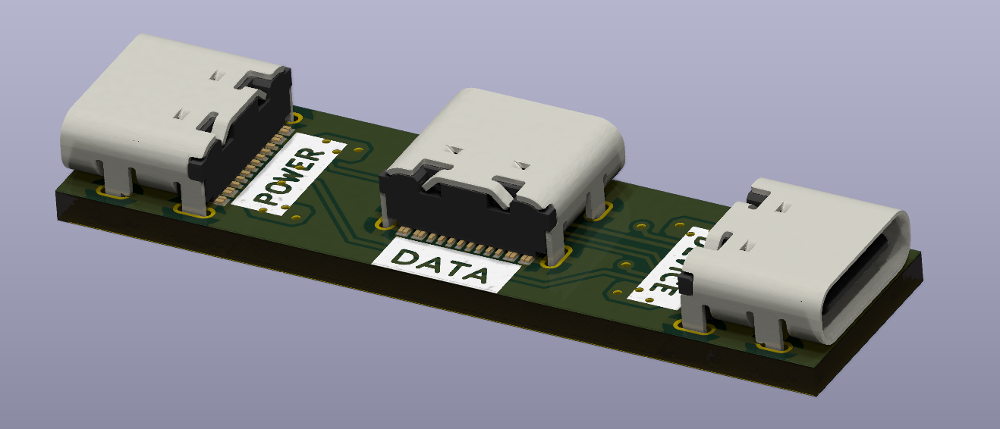
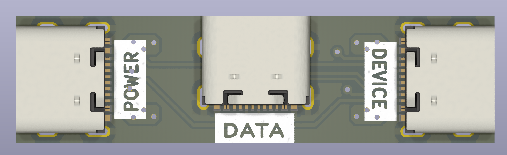
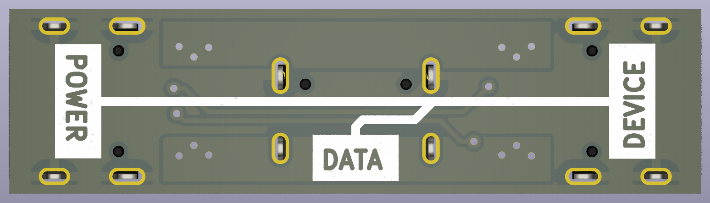

# USB-C_Splitter

This project is a simple solution to the problem of working with USB-PD devices on a computer that does not have a USB-PD capable port. By splitting off the standard USB 2.0 data lines to a seperate port, with only a shared ground connection. We can experiment and develop with USB PD devices on any computer with a USB 2.0 port even if it does not support USB PD.

## How to get one
Place an order at your favorite board house using the [gerber files](production/gerber.zip) in the [production](production/) folder.
Get 3 USB-C 2.0 connectors from GCT with the model number `USB4105-GF-A-120`.
Soldering should be possible by hand, although it will require a steady hand, lots of flux and a decent soldering iron. The USB-C connectors are quite small and have a lot of pins. If you are not comfortable soldering SMD components, you can always order the board with assembly from your favorite board house.

## How to use
Simply plug in your USB-PD capable device in the "Device" port, plug a cable to your computer into the "Data" port and the remaining "Power" port is now available for you to use to power your device. All ports are USB-C 2.0 compliant and should support USB 2.0 speeds.

## License
This project is licensed under the CERN License - see the [LICENSE](LICENSE) file for details
